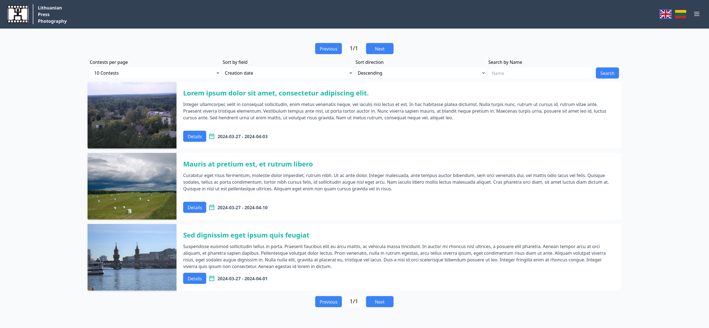

# Lithuanian Press Photography Club Website Project - Team Javinukai

## Live version
Live versions can accessed on https://javinukai.rhoopoe.com/ and https://lietuvos-spaudos-fotografija.rhoopoe.com/. The site in the first link was the development site and uses H2 as the database and NGINX as a static file webserver. The second site points to the final version of the site. This version uses PostgreSQL as the database, the frontend files are server by the Spring Boot app and the application itself is deployed on a Tomcat 10 server. On both sites all system parts are containerized, requests are passed through a Cloudflare proxy with geographic restrictions (Lithuania only).

## Deployment
The entire application is packaged as a convenient docker container. To deploy the site on a server you must have docker installed on the target machine. Deployment steps are as follows:
- clone repository and switch to deployment branch. An Dockerfile and docker-compose.yml file should be present in the root directory
- run command `docker compose up -d`. This will start the creation of the app and database images + containers.
- the application should be accessible on `http://localhost:8080`. You may remove the port mapping configuration settings from the Dockerfile and compose file if you wish to use a reverse proxy container

## Initial configuration
By default the application has 3 default contests, 12 categories and 16 users. The default site admin login credentials are (jdoe@mail.com/password) and should be changed after first use. Important system parameters may be configured in the application.yml file which is located in the backend directory (src/main/resources/application.yml). The following settings may be changed:
- image file and request size
- backend host adress (host) and frotnent server host (client)
- SMTP email server settings. Please consult your email provider for the posibility of obtaining SMTP credentials
- default user entry limits
- password reset and email confirmation token length
- JWT signing secret key. DO NOT USE THE PROVIDED DEFAULT
- JWT token and cookie validity time in hours

## Building and running a local version
If you wish to build and run the website locally you must have JDK 17, Node +20 installled on your system. Keep in mind that the development version uses an in-memory H2 database, so all data is lost after reaload. The steps for building and running a development version locally are as follows:
- clone repository and switch to development branch
- go to the frontend directory and run the command `npm i`. This will install all frontend dependencies.
- in the same direcoty run command `npm run dev`. This will start a frontend development server on standart port 5173, you can access it through http://localhost:5173
- go to the backend root directory and run command `mvn clean install -DskipTests=true`. This will create a *.jar file in the target directory of the backend directory
- in the same directory run the command `java -jar (jar-file-name).jar`. This will start the backend server on port 8080 of the local host/machine
